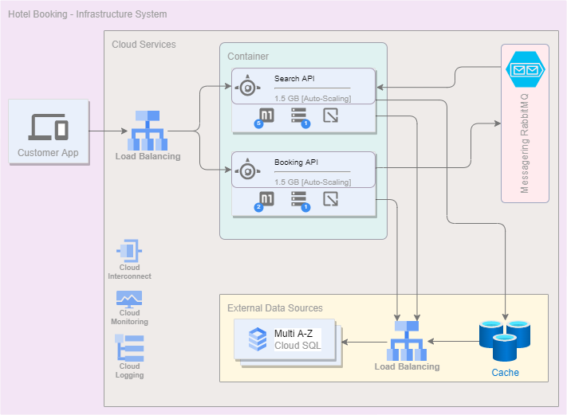
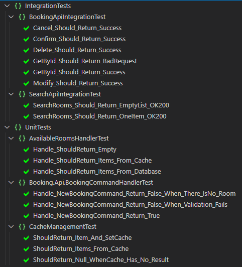
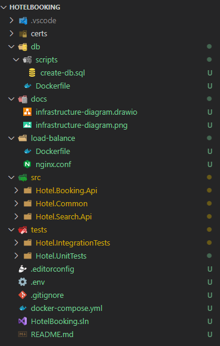
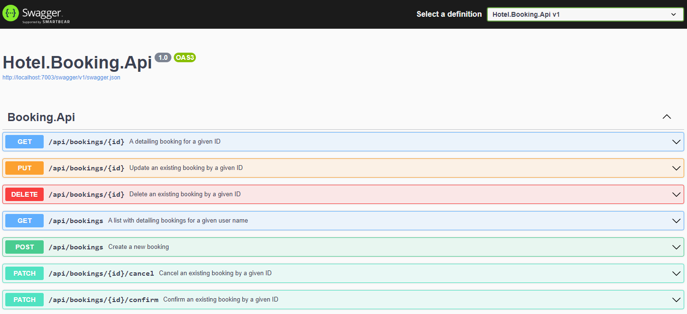
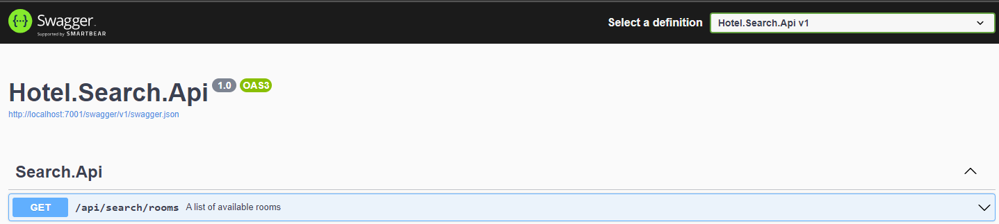

# Hotel Booking

Post-Covid scenario:
People are now free to travel everywhere but because of the pandemic, a lot of hotels
went bankrupt. Some former famous travel places are left with only one hotel.
This project aims to delivery a booking API for the very last hotel in Cancun.

The requirements are:

* Non Functional:
 - API will be maintained by the hotel’s IT department.
 - As it’s the very last hotel, the quality of service must be 99.99 to 100% => no downtime
 - To simplify the API is insecure

* Functional:
 - For the purpose of the test, we assume the hotel has only one room available
 - To give a chance to everyone to book the room, the stay can’t be longer than 3 days and can’t be reserved more than 30 days in advance.
 - All reservations start at least the next day of booking,
 - To simplify the use case, a “DAY’ in the hotel room starts from 00:00 to 23:59:59.
 - Every end-user can check the room availability, place a reservation, cancel it or modify it.

---

## Assumption
The project whould be easy to keep grown and monitired.
In order to attend the availability some aspects should be considered:
- Load balancing to distribute the incoming traffic.
- Database should have high availability, and be able to have Multi-AZ deployment.
- Caching to improve response and reduce the need for database queries.
- Auto-scaling to be resilient during peak periods.
- Monitoring and alerting to empower the IT departments to handle any issue quickly.
- Disaster recovery to ensure the system remains operational.
- Authentication and Authorization can be added as new function in the future.
- No CRUD for rooms or any related data will be necessary.
- The business role can inforce the days availability.

## Infrastructure

In real scenarios most of the non-functional requirementes can be provided by many players like AWS, Azure or GCP. 



For purpose os this project consider the following recommeendation:


### Production
    
Amazon Webservice can provide the load balance, Database Multi-AZ, Caching, auto-scale, Monitoring/Alerts.

### Complete architecture implementing the most important and used concerns as:

- Hexagonal Architecture
- Clean Code
- Clean Architecture
- Events
- Notification
- Validations
- CQRS (Imediate Consistency)
- Retry Pattern
- Unit of Work
- Repository
- Specification Pattern
- Unit Tests
- Integration Tests
- Migrations

Attention! Even though some architectures were mentioned, the approach was to focus on the feature, so not all layers usually present in the mentioned items will not be present here.

All tests are being passed.


### To Run locally with VS/VS Code and Docker:

You will need:

- Docker
- SQL instance (or container)
- Redis
- Seq - [follow the link](https://datalust.co/seq)
- RabbitMQ

So you can edit the Docker compose to just run the database and queue dependencies and save your time.
For the very first execution:

```
docker-compose up --build -d
```

after:

```
docker-compose up -d
```


For local puporse all the environment going to be simulate by containers.
- LoadBalance: NGINX
- Observability: Datalust/SEQ going to provide the logs and monitoring
- Database: SQL Server, each one per microservice

#### Make sure to run the migrations for projects

It will create the database and seed initial data.

```
cd src\Hotel.Booking.Api
dotnet ef database update
```

```
cd src\Hotel.Search.Api
dotnet ef database update
```

## Project Structure



As this POC has no Authentication/Authorization other security concerns were postponed for the future. Even so, a step was added in the `docker-compose` to create local certifications and keys. In absence of vault service a `.ENV` was created to store the passwords and inject automatically in the compose, however, the microservices are still reading it from `appSettings`

For purposes of the POC the `docker-compose` create at least two services of each microservice to simulate multi instances and provide high availability. 

### Swagger Pages



---

